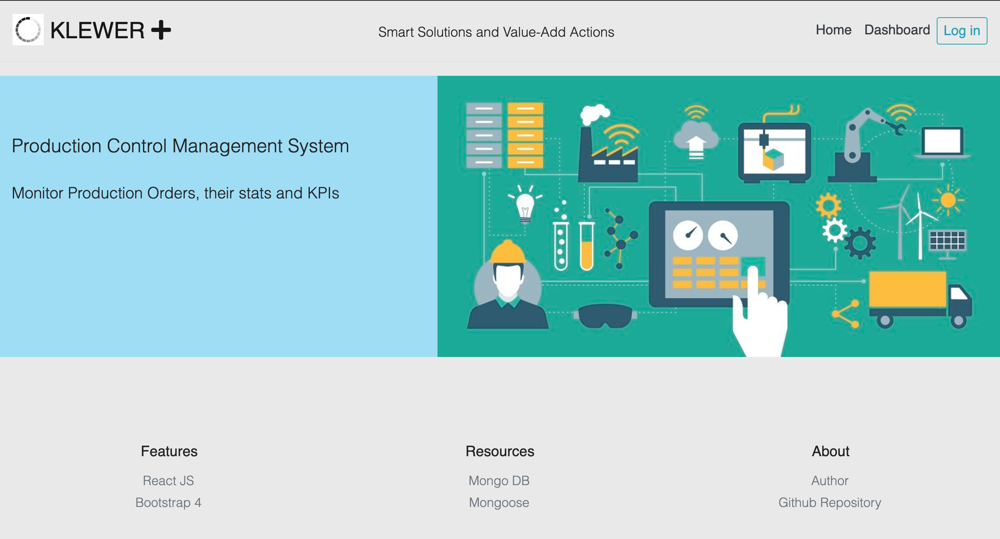

# Project Title

#### KLEWERT FERT- MOD  
Production Control Management System

## Screenshots / Demo

## What the project does

The project is a very basic Production Control Management System that allows small manufacturing companies to manage their production orders through the different production stages while collecting relevant statistics in order to later display them graphically & transformed into Key Process Indicators KPIs.

## Why the project is useful

The main goal of the project is to use current tech in order to tackle inefficiencies of managing small shops through spreadsheets where all kinf of mistakes can occur. By using IT solutions i.e. information validation and safer information storage we intend to create value to small shop owners.

## How does it works

Feel free to contact me in order to handle the proper access to the app.

## How can I use it

There are two ways to test this:

* The easy way: just go to the app page and test it [KLEWERT](https://klewert.herokuapp.com/).
* The not that easy way: you would need to clone/download the repository and install the necessary dependencies with the command “npm install” and do not forget about the DB settings.

## Where users can get help with your project - Built With:

* [HTML](https://developer.mozilla.org/en-US/docs/Web/HTML)
* [CSS](https://developer.mozilla.org/en-US/docs/Web/CSS)
* [Javascript](https://www.javascript.com/)
* [ReactJS](https://reactjs.org/docs/getting-started.html)
* [NodeJs](https://nodejs.org/en/)
* [Express](https://www.npmjs.com/package/express)
* [Bootstrap](https://getbootstrap.com/)
* [MongoDB](http://mongodb.github.io/node-mongodb-native/)
* [Mongoose](https://mongoosejs.com/)
* [express-session](https://www.npmjs.com/package/express-session)
* [bcrypt](https://www.npmjs.com/package/bcrypt)
* [passport](https://www.npmjs.com/package/passport)
* [axios](https://www.npmjs.com/package/axios)
* [chartJS](https://www.chartjs.org/docs/latest/)

## Who maintains and contributes to the project - Author:

* **Sergio Rodriguez** - [sergioardz](https://github.com/sergioardz)

## License

This project is licensed under the MIT License - see the [LICENSE.md](LICENSE.md) file for details

## Acknowledgments

* Juan Castañeda
* Raquel Zúñiga
* Rafael González
* Enrique Goldman

## URLS

* [Github project](https://github.com/sergioardz/final-project)
* [Heroku project](https://klewert.herokuapp.com/)